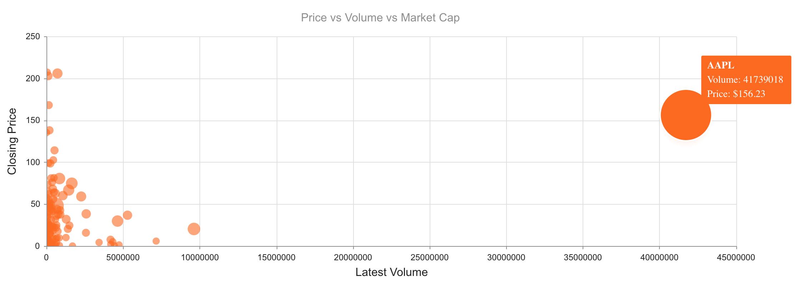

# Kendo UI Bubble Chart for Vue

## Overview

A bubble chart is a kind of scatter chart that visualizes data points using three variables. The position of the data on the horizontal and vertical axis represent two variables. The size of the data point, as depicted by a bubble graphic, represents the third variable. This demo depicts a bubble chart showing the price, volume, and market cap of different stocks. The market cap is represented by the size of the bubble. 

## Example



## Getting Started

See the following tutorial for instructions on basic usage:

[How to Use a Vue Scatter or Bubble Chart UI Component in Your Web App](https://www.telerik.com/blogs/how-to-use-a-vue-scatter-or-bubble-chart-ui-component-in-your-web-app)

## Build Setup

``` bash
# install dependencies
npm install

# serve with hot reload at localhost:8080
npm run dev

# build for production with minification
npm run build
```

## Related Links

- [Kendo UI Pie Chart for Vue](https://github.com/albertaw/kendoui-piechart)
- [Kendo UI Donut Chart for Vue](https://github.com/albertaw/kendoui-donutchart)
- [Kendo UI Scatter Chart for Vue](https://github.com/albertaw/kendoui-scatterchart)
- [Kendo UI Bar Chart for Vue](https://github.com/albertaw/kendoui-barchart)
- [Kendo UI Line Chart for Vue](https://github.com/albertaw/kendoui-linechart)
- [Kendo UI StockChart for Vue](https://github.com/albertaw/kendoui-stockchart)
- [Kendo UI Sparkline for Vue](https://github.com/albertaw/kendoui-sparkline)


